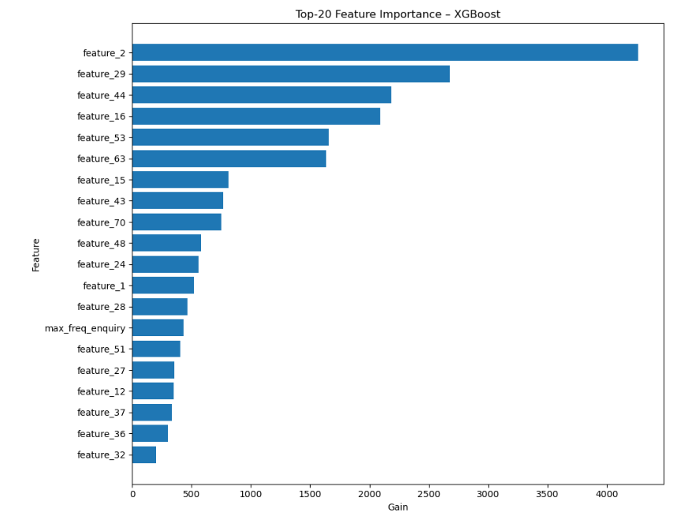
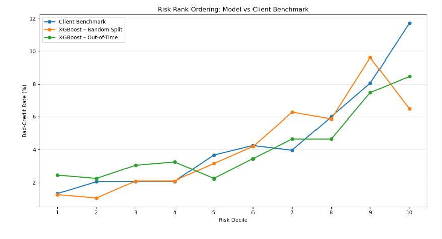
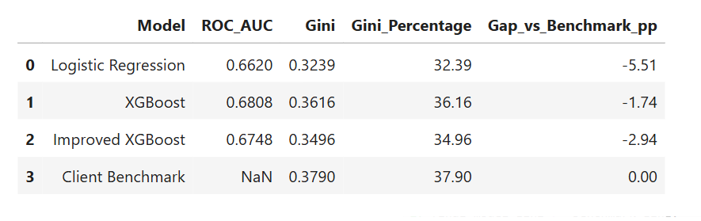

# Banking Credit Risk Prediction

## 📌 Project Overview

This project focuses on predicting customer credit risk using machine
learning techniques.

The objective is to identify potentially high-risk customers and support
financial institutions in making better credit-risk assessment and
decision-making.

The project integrates customer demographic, account, payment-history,
and credit-enquiry information to build a machine learning-based
credit-risk prediction and ranking framework.

---

## 🎯 Business Objective

The primary goal is to:

- Identify customers with higher credit-risk probability
- Rank customers according to their predicted risk
- Support early risk identification
- Provide insights that can assist credit-risk decision-making
- Evaluate model performance against a client benchmark

---

## 🗂️ Project Structure

```text
Banking_Credit_Risk_Prediction/
│
├── Bank_project_GitHub.ipynb
├── requirements.txt
│
├── data/
│   └── README.md
│
└── images/
    ├── feature_importance.png
    ├── model_comparison.png
    └── risk_decile.png
---

## 🔍 Project Workflow

### 1. Data Loading and Quality Assessment
- Loaded customer-related datasets
- Performed initial data-quality checks
- Identified missing values and duplicate records

### 2. Data Cleaning
- Cleaned inconsistent data
- Handled missing values
- Validated feature quality

### 3. Temporal Data Preparation
- Prepared date-related variables
- Performed temporal validation

### 4. Payment History Analysis
- Analysed payment behaviour
- Engineered DPD-related features
- Created account-level payment features

### 5. Credit Enquiry Analysis
- Analysed enquiry behaviour
- Created enquiry-based customer features
- Captured enquiry frequency and recency patterns

### 6. Risk Feature Engineering
- Developed 30+ DPD-related risk features
- Integrated account, payment and enquiry information

### 7. Demographic Feature Analysis
- Analysed demographic characteristics
- Performed semantic validation of features

### 8. Modelling Dataset Preparation
- Performed final data-quality checks
- Prepared the final modelling dataset

### 9. Preprocessing
- Handled missing values
- Encoded categorical variables
- Identified and removed ID/contact-like features

### 10. Machine Learning Models
The following models were evaluated:

- Logistic Regression
- XGBoost
- Improved XGBoost

### 11. Model Evaluation
Models were evaluated using:

- ROC-AUC
- Gini coefficient
- Risk rank ordering
- Out-of-time validation

---

## 📊 Model Performance

| Model | ROC-AUC | Gini |
|---|---:|---:|
| Logistic Regression | 0.6620 | 32.39% |
| XGBoost | 0.6808 | 36.16% |
| Improved XGBoost | 0.6748 | 34.96% |
| Client Benchmark | — | 37.90% |

The original XGBoost model achieved the best performance among the
evaluated models on the random-split validation.

### Out-of-Time Validation

The out-of-time evaluation produced a Gini of **26.50%**, showing a
performance decline compared with the random-split evaluation.

This highlights the importance of temporal validation when developing
credit-risk models.

---

## 📈 Model Insights

### Feature Importance

The XGBoost model's feature-importance analysis was used to understand
which variables contributed most strongly to model predictions.



### Risk Rank Ordering

Risk decile analysis was performed to evaluate how effectively the model
ranked customers according to credit risk.



### Model Comparison



---

## 💼 Business Impact

The risk-ranking analysis provides a practical way to prioritize
customers for further credit-risk assessment.

The highest-risk decile showed a substantially higher bad-credit rate
than the lowest-risk decile.

The top 10% risk group achieved approximately **2.03× lift** and captured
approximately **20.29% of observed bad customers**.

The top 30% risk group captured approximately **49.28% of observed bad
customers**.

These results demonstrate the potential usefulness of risk ranking for
prioritizing higher-risk customers.

---

## ⚠️ Limitations

- Out-of-time performance was lower than random-split performance.
- The model requires further validation before production deployment.
- Calibration and monitoring would be required in a real-world setting.
- Additional model refinement may be required to reach or exceed the
  client benchmark.

---

## 🚀 Future Scope

- Improve temporal model stability
- Perform probability calibration
- Explore additional feature engineering
- Apply advanced hyperparameter optimization
- Monitor model drift
- Develop production-ready risk scoring pipelines
- Evaluate model performance on future customer populations

---

## 🛠️ Technologies Used

- Python
- Pandas
- NumPy
- Scikit-learn
- XGBoost
- Matplotlib
- Seaborn
- Jupyter Notebook

---

## 👩‍💻 Project Focus

**Machine Learning | Credit Risk Analytics | Feature Engineering |
XGBoost | Risk Ranking | Business Analytics**
